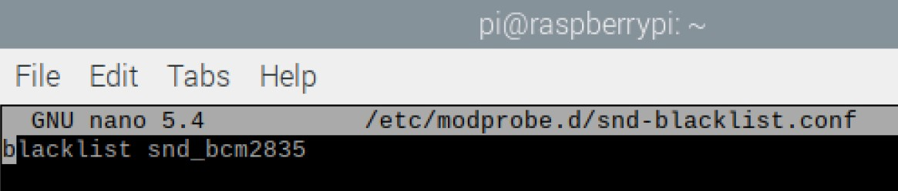
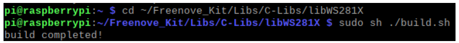
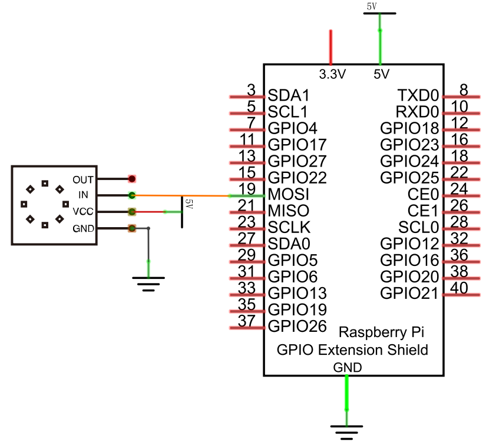
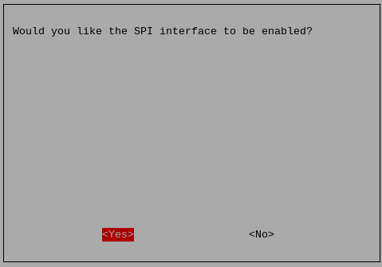

##############################################################################
Chapter LEDpixelRotary Encoder
##############################################################################

In this chapter, we will learn Freenove 8 RGB LED Module.

 .. note::

    **If your Raspberry PI System is Bookworm, skip 32.1 and 32.2 and look at 32.3 instead. Because 32.1 and 32.2 use the rpi_ws2812 library, they are not compatible with Raspberry Pi5.**

Project LEDpixel
****************************************************************

This project will achieve an Freenove 8 RGB LED Module flowing water.

Component List
================================================================

.. table:: 
    :align: center
    :width: 80%

    +--------------------------------------------+-------------------+
    |1. Raspberry Pi (with 40 GPIO) x1           |                   |
    |                                            | Jumper Wires x4   |
    |2. GPIO Extension Board & Ribbon Cable x1   |                   |
    |                                            |  |jumper-wire|    |
    |3. Breadboard x1                            |                   |
    +--------------------------------------------+-------------------+
    |Freenove 8 RGB LED Module x1                                    |
    |                                                                |
    |  |LEDpixel|                                                    |
    +----------------------------------------------------------------+

.. |jumper-wire| image:: ../_static/imgs/jumper-wire.png
.. |LEDpixel| image:: ../_static/imgs/LEDpixel.png
    :width: 50%

Component knowledge
================================================================

Freenove 8 RGB LED Module
----------------------------------------------------------------

The Freenove 8 RGB LED Module is as below. You can use only one data pin to control the eight LEDs on the module. As shown below:

.. image:: ../_static/imgs/LEDpixel_1.png
    :align: center

And you can also control many modules at the same time. Just connect OUT pin of one module to IN pin of another module. In such way, you can use one data pin to control 8, 16, 32 … LEDs.

.. image:: ../_static/imgs/LEDpixel_2.png
    :align: center

+---------------------------------------+----------------------------------------+
|                  (IN)                 |                 (OUT)                  |
+========+==============================+========+===============================+
| symbol | Function                     | symbol | Function                      |
+--------+------------------------------+--------+-------------------------------+
| S      | Input control signal         | S      | Output control signal         |
+--------+------------------------------+--------+-------------------------------+
| V      | Power supply pin, +3.5V~5.5V | V      | Power supply pin, +3.5V~5.5V  |
+--------+------------------------------+--------+-------------------------------+
| G      | GND                          | G      | GND                           |
+--------+------------------------------+--------+-------------------------------+

Circuit
================================================================

+------------------------------------------------------------------------------------------------+
|   Schematic diagram                                                                            |
|                                                                                                |
|   |LEDpixel_Sc|                                                                                |
+------------------------------------------------------------------------------------------------+
|   Hardware connection. If you need any support,please feel free to contact us via:             |
|                                                                                                |
|   support@freenove.com                                                                         | 
|                                                                                                |
|   |LEDpixel_Fr|                                                                                |
+------------------------------------------------------------------------------------------------+

.. |LEDpixel_Sc| image:: ../_static/imgs/LEDpixel_Sc.png
.. |LEDpixel_Fr| image:: ../_static/imgs/LEDpixel_Fr.png

.. _additional supplements:

Additional supplement 
======================================

Raspbery Pi, other than 4B and 400, nees to disable the audio module, othewise the LED will not work properly.

1.	Create a new snd-blacklist.conf and open it for editing

.. code-block:: console    
    
    $ sudo nano /etc/modprobe.d/snd-blacklist.conf

Add following content: After adding the contents, you need to press Ctrl+O, Enter, Ctrl+Z.

.. code-block:: console    
    
    $ blacklist snd_bcm2835

2.	We also need to edit config file.

.. code-block:: console    
    
    $ sudo nano /boot/firmware/config.txt

Find the contents of the following two lines (with Ctrl + W you can search):

.. code-block:: console    
    
    $ # Enable audio (loads snd_bcm2835)
    $ dtparam=audio=on

Add # to comment out the second line. Press Ctrl+O, Enter, Ctrl+X.

.. code-block:: console    
    
    $ # Enable audio (loads snd_bcm2835)
    $ # dtparam=audio=on

.. image:: ../_static/imgs/audio.png
    :align: center

It will take effect after restarting, restart your RPi.

If you want to restart the audio module, just restore the content modified in the above two steps.

Code
================================================================

C Code Ledpixel
----------------------------------------------------------------

Before running C code, please install WS281X library.

1.  Enter the directory where the library locates:

.. code-block:: console    
    
    $ cd ~/Freenove_Kit/Libs/C-Libs/libWS281X

2.  Run the program

.. code-block:: console    
    
    $ sudo sh ./build.sh

The installation is completed as shown in the figure below

First, observe the project result, and then learn about the code in detail.

.. hint:: 
    :red:`If you have any concerns, please contact us via:` support@freenove.com

1.	Use cd command to enter 32.1.1_Ledpixel directory of C code.

.. code-block:: console    
    
    $ cd ~/Freenove_Kit/Code/C_Code/32.1.1_Ledpixel

2.	Use following command to compile " Ledpixel.cpp" and generate executable file "Ledpixel". 

.. code-block:: console    
    
    $ sudo g++ Ledpixel.cpp -o Ledpixel -lwiringPi -lWS281X

3.	Run the generated file " Ledpixel".

.. code-block:: console    
    
    $ sudo ./Ledpixel

After the program runs, the LEDpixel will emit red, blue and green colors in turn like flowing water. If your Freenove 8 RGB LED Module doesn't work, you can try :ref:`additional supplements <additional supplements>` to solve.

The following is the program code:

.. literalinclude:: ../../../freenove_Kit/Code/C_Code/32.1.1_Ledpixel/Ledpixel.cpp
    :linenos: 
    :language: C
    :dedent:

Include "Freenove_WS2812_Lib_for_Raspberry_Pi.hpp"

.. code-block:: c

    #include "Freenove_WS2812_Lib_for_Raspberry_Pi.hpp"

Create the object of the class and set the brightness to 50%. The eight LEDs will then light up red, green and blue in turn.

.. literalinclude:: ../../../freenove_Kit/Code/C_Code/32.1.1_Ledpixel/Ledpixel.cpp
    :linenos: 
    :language: C
    :lines: 24-42
    :dedent:

Project RainbowLight
****************************************************************

In this project, we will learn to control the LED module with a potentiometer.

Component List
================================================================

.. table:: 
    :width: 100%
    :align: center

    +--------------------------------------------------+-------------------------------------------------+
    |1. Raspberry Pi (with 40 GPIO) x1                 |                                                 |
    |                                                  | Jumper Wires x13                                |
    |2. GPIO Extension Board & Ribbon Cable x1         |                                                 |
    |                                                  |  |jumper-wire|                                  |
    |3. Breadboard x1                                  |                                                 |
    +--------------------------------+-----------------+-------------------+-----------------------------+
    |Freenove 8 RGB LED Module x1    |  Rotary Potentiometer x1            |  ADC Module x1              |
    |                                |                                     |                             |
    |  |LEDpixel|                    |   |Rotary-potentiometer|            |  |ADC-module-2|             |
    +--------------------------------+-------------------------------------+-----------------------------+

.. |ADC-module-2| image:: ../_static/imgs/ADC-module-2.png
    :width: 50%

Circuit
================================================================

+------------------------------------------------------------------------------------------------+
|   Schematic diagram                                                                            |
|                                                                                                |
|   |LEDpixel_Sc_1|                                                                              |
+------------------------------------------------------------------------------------------------+
|   Hardware connection. If you need any support,please feel free to contact us via:             |
|                                                                                                |
|   support@freenove.com                                                                         | 
|                                                                                                |
|   |LEDpixel_Fr_1|                                                                              |
+------------------------------------------------------------------------------------------------+

.. |LEDpixel_Sc_1| image:: ../_static/imgs/LEDpixel_Sc_1.png
.. |LEDpixel_Fr_1| image:: ../_static/imgs/LEDpixel_Fr_1.png

Code
================================================================

C Code RainbowLight
----------------------------------------------------------------

If you did not configure I2C, please refer to :ref:`Chapter 7<ADC>`. If you did, please continue.

First, observe the project result, and then learn about the code in detail.

.. hint:: 
    :red:`If you have any concerns, please contact us via:` support@freenove.com

1.  Use cd command to enter 32.2.1_RainbowLight directory of C code.

.. code-block:: console    
    
    $ cd ~/Freenove_Kit/Code/C_Code/32.2.1_RainbowLight

2.  Use following command to compile " RainbowLight.cpp " and generate executable file " RainbowLight ". 

.. code-block:: console    
    
    $ sudo g++ RainbowLight.cpp -o RainbowLight -lADCDevice -lWS281X -lwiringPi

3.  Run the generated file " RainbowLight ".

.. code-block:: console    
    
    $ sudo ./RainbowLight

After running the program, you can change the color of the LED module by rotating the potentiometer.

The following is the program code:

.. literalinclude:: ../../../freenove_Kit/Code/C_Code/32.2.1_RainbowLight/RainbowLight.cpp
    :linenos: 
    :language: C
    :dedent:

This function converts HSL colors to RGB colors.

.. literalinclude:: ../../../freenove_Kit/Code/C_Code/32.2.1_RainbowLight/RainbowLight.cpp
    :linenos: 
    :language: C
    :lines: 14-33
    :dedent:

Read the ADC value of channel 2 in an infinite loop. Let the color of the eight LEDs change according to the value of the ADC.

.. literalinclude:: ../../../freenove_Kit/Code/C_Code/32.2.1_RainbowLight/RainbowLight.cpp
    :linenos: 
    :language: C
    :lines: 54-64
    :dedent:

Project SpiLEDpixel
****************************************************************

This project will control ledpixel to display any color by the Raspberry Pi's SPI.

Component List
================================================================

+--------------------------------------------------+-------------------------------------------------+
|1. Raspberry Pi (with 40 GPIO) x1                 |                                                 |
|                                                  | Jumper Wires x4                                 |
|2. GPIO Extension Board & Ribbon Cable x1         |                                                 |
|                                                  |  |jumper-wire|                                  |
|3. Breadboard x1                                  |                                                 |
+--------------------------------------------------+-------------------------------------------------+
|Freenove 8 RGB LED Module x1                                                                        |
|                                                                                                    |
|  |LEDpixel|                                                                                        |
+----------------------------------------------------------------------------------------------------+

Component knowledge
================================================================

Freenove 8 RGB LED Module
----------------------------------------------------------------

The Freenove 8 RGB LED Module is as below. You can use only one data pin to control the eight LEDs on the module. As shown below:

.. image:: ../_static/imgs/LEDpixel_1.png
    :align: center

And you can also control many modules at the same time. Just connect OUT pin of one module to IN pin of another module. In such way, you can use one data pin to control 8, 16, 32 … LEDs.

.. image:: ../_static/imgs/LEDpixel_2.png
    :align: center

+---------------------------------------+----------------------------------------+
|                  (IN)                 |                 (OUT)                  |
+========+==============================+========+===============================+
| symbol | Function                     | symbol | Function                      |
+--------+------------------------------+--------+-------------------------------+
| S      | Input control signal         | S      | Output control signal         |
+--------+------------------------------+--------+-------------------------------+
| V      | Power supply pin, +3.5V~5.5V | V      | Power supply pin, +3.5V~5.5V  |
+--------+------------------------------+--------+-------------------------------+
| G      | GND                          | G      | GND                           |
+--------+------------------------------+--------+-------------------------------+

Circuit
================================================================

+------------------------------------------------------------------------------------------------+
|   Schematic diagram                                                                            |
|                                                                                                |
|   |LEDpixel_Sc_2|                                                                              |
+------------------------------------------------------------------------------------------------+
|   Hardware connection. If you need any support,please feel free to contact us via:             |
|                                                                                                |
|   support@freenove.com                                                                         | 
|                                                                                                |
|   |LEDpixel_Fr_2|                                                                              |
+------------------------------------------------------------------------------------------------+

.. |LEDpixel_Fr_2| image:: ../_static/imgs/LEDpixel_Fr_2.png

Before you run your python code, check that the spidev library exists.

Enter the following command to install.

.. code-block:: console    
    
    $ pip list

The spidev is installed on Raspberry PI by default. As shown in the figure below.

.. image:: ../_static/imgs/pip_list.png
    :align: center

If your Raspberry PI system does not have this library, you can find **spidev-3.6.tar.gz** in **Freenove_Kit/Libs/Python-Libs**.

Enter the following instructions to install spidev.

.. code-block:: console    
    
    $ cd Freenove_Kit/Libs/Python-Libs
    $ tar -zxvf spidev-3.6.tar.gz
    $ cd spidev-3.6
    $ sudo python setup.py install

The installation is complete as shown in the following figure.

.. image:: ../_static/imgs/installation.png
    :align: center

.. hint:: 
    
    :red:`If you have any concerns, please contact us via:` support@freenove.com

Additional supplement 
================================================================

Note that the frequency of the SPI changes as the CPU frequency self-regulates, so we need to fix the cpu frequency before we start using the code. Please refer to the following operations.

1. Open the config.txt file and prepare to edit it.

.. code-block:: console    
    
    $ sudo nano /boot/firmware/config.txt

2. If your Raspberry PI is Raspberry PI 4 or Raspberry PI 5, please add at the bottom:

.. code-block:: console    
    
    $ force_turbo=1

If your Raspberry PI is Raspberry PI 3, add it at the bottom:

.. code-block:: console    
    
    $ core_freq=250

3. Save the file.

4. Turn on the spi feature of the Raspberry PI.

.. code-block:: console    
    
    $ sudo raspi-config

5. **Select Interface Options, then SPI, and turn it on**.

6. Select Finish.

7. Reboot the Raspberry PI.

.. code-block:: console    
    
    $ sudo reboot

Code
================================================================

C Code SpiLedpixel
----------------------------------------------------------------

Use cd command to enter 32.3.1_SpiLedpixel directory of C code.

.. code-block:: console    
    
    $ cd ~/Freenove_Kit/Code/C_Code/32.3.1_SpiLedpixel

Use following command to compile " Ledpixel.cpp" and generate executable file "Ledpixel". 

.. code-block:: console    
    
    $ g++ SpiLedpixel.cpp Freenove_WS2812_SPI.cpp -o main

Run the generated file "main". **Please use one of the following commands to control the ledpixel**.

After the program runs, the led pixels will emit red, blue and green three colors in turn like water. If your Freenove 8 RGB LED module is not working, you can try additional supplements to fix it.

.. code-block:: console  
    
    $ sudo ./main RGB

After the program runs, the led pixels will emit a rainbow of colors and slowly rotate.

.. code-block:: console    
    
    $ sudo ./main Rainbow

After the program runs, the led will slowly turn on and then slowly turn off.

.. code-block:: console    
    
    $ sudo ./main Breathing

The following is the program code:

.. literalinclude:: ../../../freenove_Kit/Code/C_Code/32.3.1_SpiLedpixel/SpiLedpixel.cpp
    :linenos: 
    :language: C
    :dedent:

.. code-block:: c   
    :linenos:

    #include "Freenove_WS2812_SPI.h"

To create Ledpixel objects, you can use the default parameters or you can use custom parameters.

.. code-block:: c   
    :linenos:

    //Freenove_WS2812_SPI strip = Freenove_WS2812_SPI(8, TYPE_GRB);//led_count, led_type
    Freenove_WS2812_SPI strip = Freenove_WS2812_SPI();//led_count=8, led_type=TYPE_GRB

Create an interrupt event if the user presses Ctrl+C to turn off the lights before exiting the program.

.. code-block:: c  
    :linenos:

    void Ctrl_C_Handler(int value){
        strip.end();
        exit(0);
    }

    //Ctrl+C Event
    signal(SIGINT, Ctrl_C_Handler);  

Initialize ledpixel, set the brightness value of the color light to 20, set the type of the color light to GRB type.

.. code-block:: c  
    :linenos:

    //Init ledpixel
    strip.begin();
    strip.setBrightness(20);
    strip.setLedType((LED_TYPE)TYPE_GRB);

Determine the number of parameters when the executable file is invoked. If no parameters are specified, a message is displayed.

.. literalinclude:: ../../../freenove_Kit/Code/C_Code/32.3.1_SpiLedpixel/SpiLedpixel.cpp
    :linenos: 
    :language: C
    :lines: 24-32
    :dedent:

If the parameter is RGB, let the ledpixel display color one by one, and then switch to another color in turn, and continue to repeat the process.

.. literalinclude:: ../../../freenove_Kit/Code/C_Code/32.3.1_SpiLedpixel/SpiLedpixel.cpp
    :linenos: 
    :language: C
    :lines: 33-47
    :dedent:

If the parameter is Rainbow, let the ledpixel display a rainbow of colors and turn slowly.

.. literalinclude:: ../../../freenove_Kit/Code/C_Code/32.3.1_SpiLedpixel/SpiLedpixel.cpp
    :linenos: 
    :language: C
    :lines: 48-57
    :dedent:

If the parameter is Breathing, let the ledpixel gradually turn on one color, slowly turn off, then switch to another color, and repeat the process.

.. literalinclude:: ../../../freenove_Kit/Code/C_Code/32.3.1_SpiLedpixel/SpiLedpixel.cpp
    :linenos: 
    :language: C
    :lines: 58-78
    :dedent: